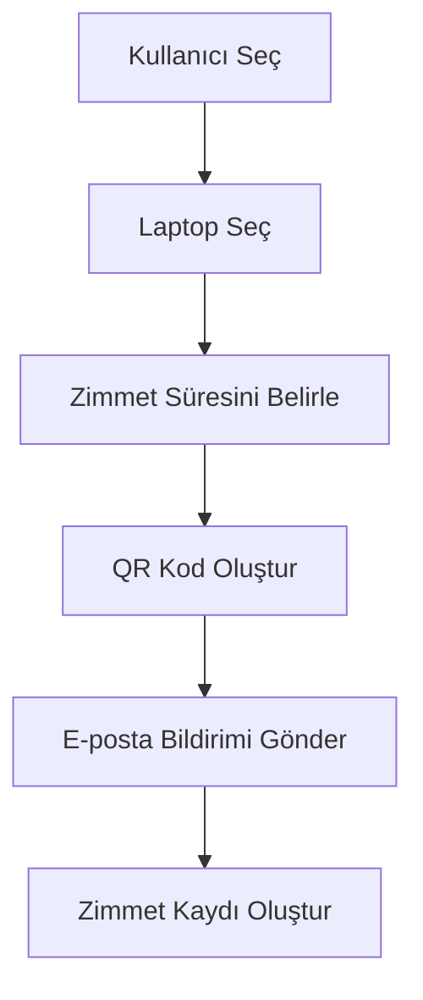
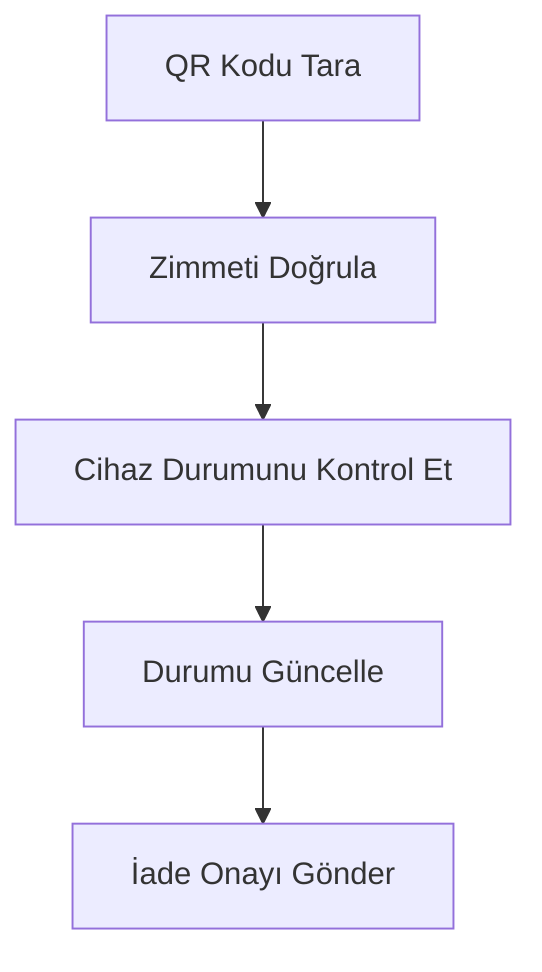
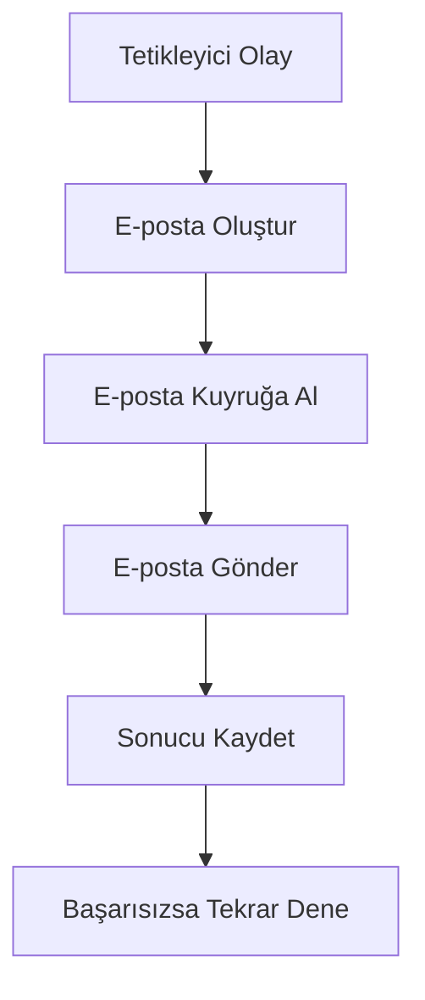
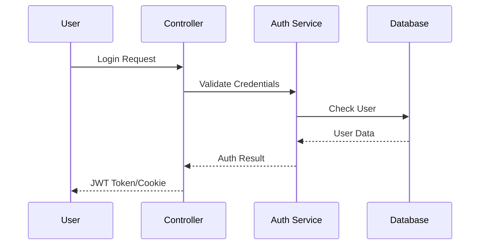

# Sistem Bileşenleri ve İş Akışları

## Temel İş Akışları

### 1. Zimmet Atama Süreci


#### Adımlar:
1. Kullanıcı seçimi ve doğrulama
2. Laptop uygunluk kontrolü
3. Tarih aralığı doğrulama
4. QR kod oluşturma
5. E-posta bildirimi
6. Veritabanı kaydı oluşturma

### 2. Zimmet İade Süreci


### 3. E-posta Bildirim Sistemi


## Veritabanı Şeması

### Temel Tablolar
```sql
-- Kullanıcılar Tablosu
CREATE TABLE Users (
    Id INT PRIMARY KEY,
    Username NVARCHAR(100),    -- Kullanıcı Adı
    Email NVARCHAR(100),       -- E-posta Adresi
    Department NVARCHAR(50)    -- Departman
)

-- Laptoplar Tablosu
CREATE TABLE Laptops (
    Id INT PRIMARY KEY,
    SerialNumber NVARCHAR(50), -- Seri Numarası
    Model NVARCHAR(100),       -- Model Bilgisi
    Status INT                 -- Durum (Müsait, Zimmette, Serviste vb.)
)

-- Zimmetler Tablosu
CREATE TABLE Assignments (
    Id INT PRIMARY KEY,
    UserId INT,               -- Kullanıcı ID
    LaptopId INT,            -- Laptop ID
    AssignDate DATETIME,     -- Zimmet Tarihi
    ReturnDate DATETIME,     -- İade Tarihi
    Status INT               -- Durum (Aktif, İade Edildi vb.)
)
```

## Servis Katmanı Implementasyonu

### Zimmet Servisi
```csharp
public class AssignmentService : IAssignmentService
{
    private readonly IAssignmentRepository _repository;
    private readonly IEmailService _emailService;
    private readonly IQRCodeService _qrCodeService;

    public async Task<Assignment> CreateAssignment(AssignmentDto dto)
    {
        // Zimmet bilgilerini doğrula
        await ValidateAssignment(dto);

        // Zimmet kaydı oluştur
        var assignment = new Assignment(dto);

        // QR kod oluştur
        var qrCode = await _qrCodeService.Generate(assignment);
        assignment.QRCodeUrl = qrCode.Url;

        // Veritabanına kaydet
        await _repository.AddAsync(assignment);

        // E-posta bildirimi gönder
        await _emailService.SendAssignmentNotification(assignment);

        return assignment;
    }
}
```

## Authentication Flow



## Notification System

### Email Templates
```html
<!-- Assignment Notification -->
<template>
    <h2>New Asset Assignment</h2>
    <p>Dear {{UserName}},</p>
    <p>You have been assigned the following asset:</p>
    <ul>
        <li>Asset: {{LaptopModel}}</li>
        <li>Serial: {{SerialNumber}}</li>
        <li>Period: {{StartDate}} to {{EndDate}}</li>
    </ul>
    
</template>
```

## Security Implementation

### 1. Authentication
- ASP.NET Core Identity configuration
- Password policies
- Multi-factor authentication (optional)
- Session management

### 2. Authorization
```csharp
[Authorize(Roles = "Admin")]
public class AssignmentsController : Controller
{
    [Authorize(Policy = "CanManageAssignments")]
    public async Task<IActionResult> Create()
    {
        // Implementation
    }
}
```

### 3. Data Protection
- Encryption at rest
- TLS for data in transit
- Secure configuration storage
- Audit logging

## Performance Optimizations

### 1. Caching Strategy
```csharp
public class LaptopService
{
    private readonly IMemoryCache _cache;
    
    public async Task<IEnumerable<Laptop>> GetAvailableLaptops()
    {
        return await _cache.GetOrCreateAsync(
            "available_laptops",
            async entry =>
            {
                entry.AbsoluteExpirationRelativeToNow = TimeSpan.FromMinutes(5);
                return await _repository.GetAvailableLaptopsAsync();
            });
    }
}
```

### 2. Database Optimizations
- Indexed views
- Proper indexing strategy
- Query optimization
- Connection pooling

### 3. Application Optimizations
- Async operations
- Resource pooling
- Minimal API responses
- Efficient client-side caching
